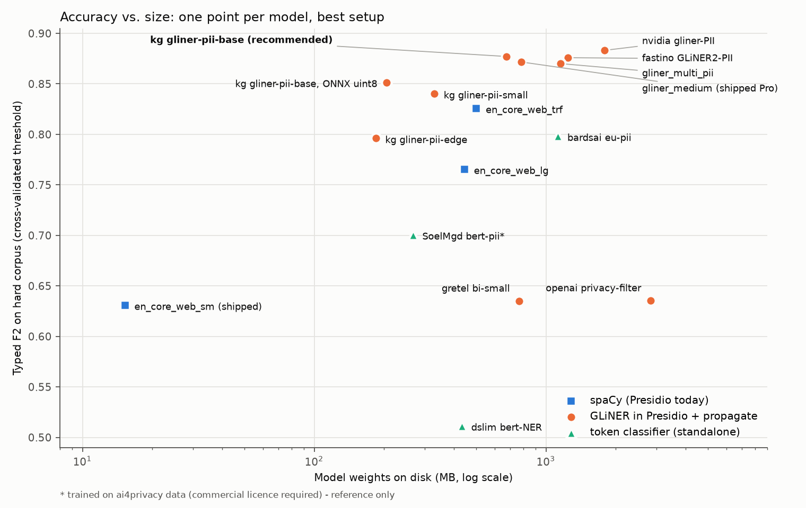

# sanctum-research

Evaluation playground for [Sanctum](https://github.com/FilippoTonci/sanctum):
model benchmarks, exploratory notebooks and cached predictions that don't
belong in the production repo.

It is kept separate so the main codebase stays airgap-clean. The research
workflows pull transformer weights from Hugging Face, which would break
Sanctum's "no runtime network calls" rule.

**Latest result:** [`REPORT.md`](REPORT.md) recommends a default NER model
to ship with Sanctum.



## Layout

```
REPORT.md                 recommendation + findings (start here)
bench/
  download_models.py      fetch every benchmarked checkpoint into ./models/
  corpus.py               load the two evaluation corpora
  predictors.py           model wrappers + the registry of benchmark configs
  run.py                  run configs (one subprocess each), cache predictions
  score.py                overlap-based metrics (leak recall, typed F1/F2, ...)
  report_tables.py        cross-validated leaderboard + chart -> results/
  postprocess.py          document-level name propagation experiment
  inspect_errors.py       print misses / false positives for one config
data/
  corpus/                 22 hand-annotated hard documents (inline markup)
  sanctum_fixtures/       copy of sanctum/tests/fixtures (12 Faker docs)
results/
  preds/                  cached predictions per config (all thresholds)
  leaderboard.csv         one row per config, CV-tuned + default thresholds
  tables.md               markdown tables used in REPORT.md
  tradeoff.png            accuracy vs size chart
models/                   downloaded weights (git-ignored, ~13 GB)
```

## Reproduce

```bash
make            # venv (pinned requirements.txt) + spaCy models + ~13 GB of weights + run + report
make report     # rebuild results/tables.md, leaderboard.csv, tradeoff.png from cached predictions
make inspect CONFIG="presidio+kg_pii_base" THR=0.2   # misses / false positives for one config
make parity     # torch-free ONNX loader (bench/gliner_onnx.py) vs the gliner library
make run-notorch  # torch-free configs in a venv without torch (true sidecar RAM)
make rerun      # force every config to run again (~10 min on an M-series Mac)
```

The cached predictions in `results/preds/` are committed, so `make report`
works without downloading any weights. Override the interpreter with
`make PYTHON=/path/to/python3.12`.

Nothing here imports Sanctum. The production Presidio setup
(`sanctum/cli/commands.py::_create_engine`) is reproduced in
`bench/predictors.py::presidio_predictor`, so the numbers match what the CLI
and desktop sidecar would produce.

GLiNER v1 checkpoints still fetch their backbone config and tokenizer by Hub
id (for example `microsoft/deberta-v3-base`). `run.py` points `HF_HOME` at
`models/_hf_cache` so those files also stay inside this repo.

The earlier notebook round (7 models on the 12 Sanctum fixtures) was removed;
`bench/` replaces it and is still in git history.
